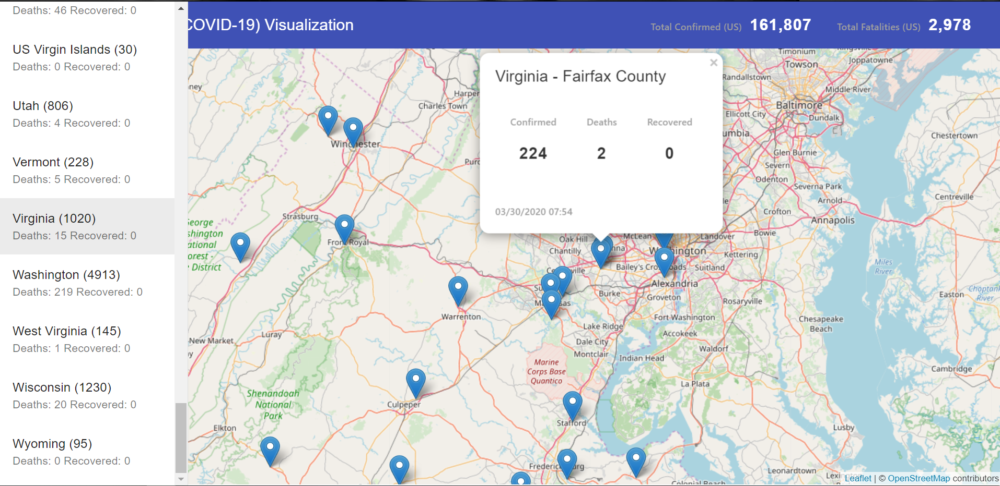

# Coronavirus Visualization 

> React application to show statistics on the coronavirus (COVID-19) using
> React-Leaflet Map

## System Requirements

- [Git](https://git-scm.com/) v2 or greater
- [NodeJS](https://nodejs.org/en/) v11 or greater
- [npm](https://www.npmjs.com/) v6 or greater

## Setup

```shell
git clone https://github.com/nathanielhall/coronavirus-visualization.git
cd coronavirus-visualization
npm install
```

## Running the app

```shell
npm start
```

This will launch the application in your browser at `http://localhost:8080`. If
the browser doesn't open, try typing in the address.

This is what you are looking for:



## Scripts

| `npm <script>` | Description               |
| -------------- | ------------------------- |
| `build`        | generate production build |
| `start`        | run dev server            |
| `lint`         | lint ts(x) files          |
| `test`         | run jest                  |
| `prettier`     | run prettier              |
